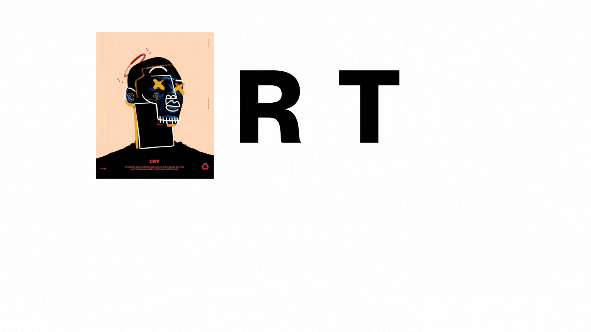
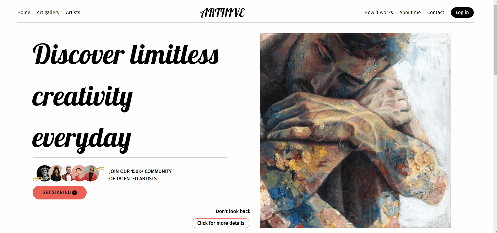
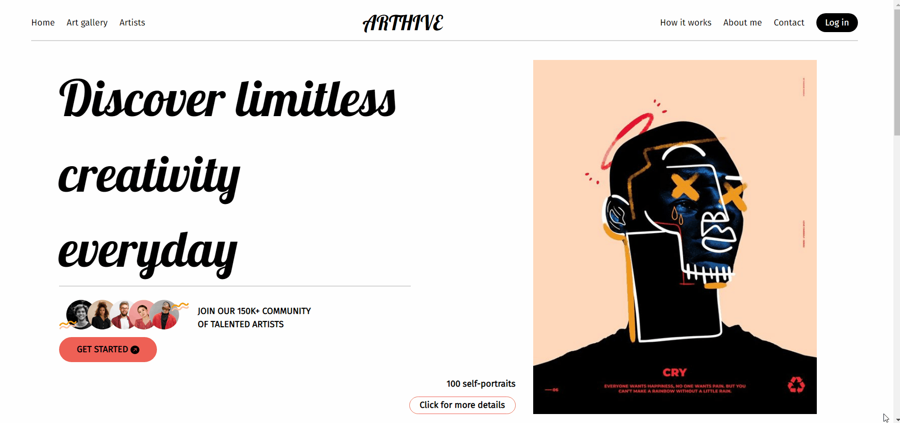

# Welcome to my frontend app - ArtHive - Art Social Platform  

<details>
  <summary>Content 📝</summary>
  <ol>
    <li><a href="#objetivo-🎯">Goals</a></li>
    <li><a href="#sobre-el-proyecto-🔎">About</a></li>
    <li><a href="#deploy-🚀">Deploy</a></li>
    <li><a href="#stack">Stack</a></li>
    <!-- <li><a href="#instalación-en-local">Installation</a></li> -->
    <li><a href="#vistas">Pages</a></li>
    <li><a href="#futuras-funcionalidades">Future functionalities</a></li>
    <!-- <li><a href="#contribuciones">Contributions</a></li> -->
    <li><a href="#licencia">License</a></li>
    <li><a href="#webgrafia">Webography</a></li>
    <li><a href="#desarrollo">Development</a></li>
    <li><a href="#agradecimientos">Thanks</a></li>
    <li><a href="#contacto">Contact</a></li>
  </ol>
</details>

## Goal 🎯
In this project from our Full Stack Bootcamp with Geekshubs we are faced with the final challenge for which we are asked to show our knowledge adquired during this 12 weeks.

We have to create a complete Web Application from scratch using the technology learnt during the bootcamp of our choice, and also, we are given the opportunity to choose the product we want to build.

For my frontend I worked with React framework and Redux.

## About 🔎
 

My project consists in a social platform where users can explore and find new art. Mainly, the idea revolves around allowing users to discover and explore art from emerging and established artists from all over the world. I am looking for an application that is open to generating spaces for dialogue between art lovers and artists, and open to stimulating the development of new quests for creative and artistic expression.

What problem do I want to solve with this development?
With the recent rise of AI technologies, I consider that on one hand many artists will be affected, but at the same time, it will encourage the use of applications like the one I would like to create, where works of art made by and for humans are valued, rewarded, and made known.

What special advantage makes your project different?
I perceive these web applications as a platform for presenting art. They try to incorporate functionalities to make it more dynamic beyond what Pinterest has, which is showing images, or a forum/blog page, or posting content. I would like to go further and have my space be more of a socio-cultural celebration, as if it were an exhibition in an art gallery where the artist is showcased and you as a user have time to appreciate it and if you want, even contact them or buy their work. Perhaps it could be like a bar that offers space on the wall to hang photographs by an amateur, or a friendly competition between a group of painters on a specific theme.

I want the art-loving user to open the app and the first thing they see is the featured artwork of the day. If they like it, they can see more by the artist, or even offer a 3D or 2D virtual space to virtually place the artwork to appreciate it in a kind of metaverse.

I worked on getting all those endpoints I built on the backend side to perfectly function on the frontend side. To do so I needed for the web to let users to register, login, book appointments, delete appointments, update appointments, update their user profiles, ... etc.. And acces the web with different roles: artist, art lover and admin.
  
## Deploy 🚀
<div align="center">
    <a href="https://ramon23.d3biezth2ueuj6.amplifyapp.com/"><strong>Url to ArtHive Web Application </strong></a>🚀🚀🚀
</div>

## Stack
<div align="center">
<a href="https://www.reactjs.com/">
    
</a>
<a href="https://developer.mozilla.org/es/docs/Web/JavaScript">
    
</a>
<a href="https://railway.com/">
    
</a>
<a href="https://developer.mozilla.org/es/docs/Web/CSS">
    
</a>
<a href="https://www.w3schools.com/html/">
    
</a>
<a href="https://react-bootstrap.github.io/">
    
</a>
<a href="https://git-scm.com/">
    
</a>
<a href="https://nodejs.org/en">
    
</a>
<a href="https://img.shields.io/badge/express.JS-F54D50?style=for-the-badge&logo=express.js&logoColor=white">
    
</a>
<a href="https://img.shields.io/badge/npm-F54D50?style=for-the-badge&logo=npm.js&logoColor=white">
    
</a>
</div>

<!-- ## Local installation
To be able to see how it works for yourself on your local computer, please follow next steps:
1. Copy the repository url and clone it on your computer with git bash: 
 ```
$git clone https://github.com/RamonFolguera/rfc-geekshubs-fsd-val-project5-26032023.git
 ```
2. Install all dependencies with: ` $ npm install `
3. ``` $ npm run dev ```
4. ... -->

## Pages
######Landing page
On the landing page we have already a randomly selected artwork registered in the data base. Everytime we land on that page we get a new one as a way to give visibility to everyone in the platform. 
Below we have a top 10 ranking of the highest rated artworks.
Before you sign in or register you are able to explore the artwork gallery. However, when you try to save the image or get to the details you are asked to sign in or register.
  
######Register page
When you register you have to choose your role Artist or Art Lover. This role will only be possible to be changed by an admin once you have registered.

######Login and Profile pages


######Artwork in detail page
Here art lovers can see more details from the artist's uploaded artworks, can comment them and rate them.

Book Appointment

Your appointments as client

Update your selected appointment

Get list of appointments as doctor

Get all registered users as admin


## Future functionaly
⬜ Search and filter tool to find a user or an appointment
⬜ Add a Superadmin role able to assign roles to our users

<!-- ## Contributions
Suggestions and contributions are more than welcomed.  

Puedes hacerlo de dos maneras:

1. Abriendo una issue
2. Crea un fork del repositorio
    - Crea una nueva rama  
        ```
        $ git checkout -b feature/nombreUsuario-mejora
        ```
    - Haz un commit con tus cambios 
        ```
        $ git commit -m 'feat: mejora X cosa'
        ```
    - Haz push a la rama 
        ```
        $ git push origin feature/nombreUsuario-mejora
        ```
    - Abre una solicitud de Pull Request -->

## License
This project has been created under a MIT License. To learn more about the details go to LICENSE.md.

## Development:

``` js
 console.log("Developed by: " + Ramón Folguera Carbonell);
```  

## Thanks:

I want to thank my GeekHub mentors for all the support they have given us everyday:

- **Dani**  
<a href="https://github.com/Dave86dev" target="_blank"></a> 

- **Jose**  
<a href="https://github.com/JoseMarin" target="_blank"></a> 

- **David**  
<a href="https://www.github.com/userGithub/" target="_blank"></a>

- ***Mara***  
<a href="https://github.com/MaraScampini" target="_blank"></a> 

## Contact

Feel free to contact me anytime, to help you with your project with React or to give me some feedback. Happy to hear from you.

<a href = "mailto:folguera.ramon@gmail.com"></a>
<a href="https://www.linkedin.com/in/ram%C3%B3n-folguera-0ab32776/" target="_blank"></a> 
</p>
